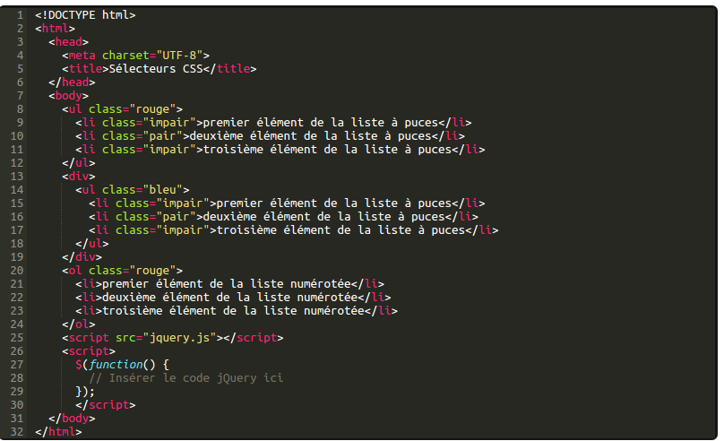
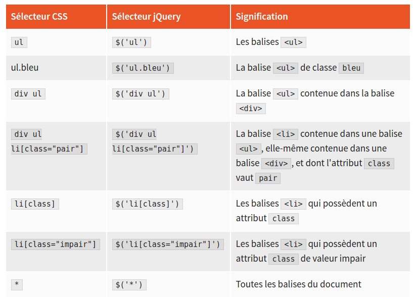

// Charger le lien de la librairie jquery dans header et animation.css voir site cdn jquery
// Avant de commencer 1ère déclaration jquery

// jquery sélectionne souvent un élément html = sélector (button)ex faire rebondir des boutons
// bounce est la classe de l'animation css

//sélectionner tous les elements de la classe .text-primary et la classe .text-primary mettre animation (bouge) animated shake ou bounce

//#target3 disparait

//De la même façon , vous pouvez ajouter des classes à un élément avec jQuery addClass()fonction, vous pouvez les supprimer avec jQuery removeClass()fonction.
//Voici comment vous feriez cela pour un bouton spécifique:
//Enlevons la btn-default classe de tous nos buttons éléments.

$("#target2").removeClass("btn-default");

//Nous pouvons également changer le CSS d'un élément HTML directement avec jQuery.
//jQuery a une fonction appelée .css()qui vous permet de modifier le CSS d'un élément.
//Voici comment nous changer sa couleur au bleu:

$("#target1").css("color", "blue");

//Lorsque vous désactivez un bouton, il deviendra grisées et ne peut plus être cliqué.
//jQuery a une fonction appelée .prop()qui vous permet d'ajuster les propriétés des éléments.
//Voici comment vous pouvez désactiver tous les boutons:

$("button").prop("disabled", true);

//jQuery a une fonction appelée .html()qui vous permet d' ajouter des balises et du texte HTML dans un élément. 
$("h3").html("<em>jQuery Playground</em>");

//Supprimer un élément HTML de votre page en utilisant jQuery.
//jQuery a une fonction appelée .remove()qui va supprimer un élément HTML entièrement

// déplacer des éléments d'un divà l' autre.
//jQuery a une fonction appelée appendTo()qui vous permet de sélectionner des éléments HTML et ajoutez - les à un autre élément.
//Par exemple, si nous voulions passer target4de notre droite et à notre bien à gauche, nous utiliserons:

$("#target4").appendTo("#left-well");

<!-- Only change code above this line. -->

  <h3 class="text-primary text-center">jQuery Playground</h3>
  

    

      <h4>#left-well</h4>
      

        <button class="btn btn-default target" id="target1">#target1</button>
        <button class="btn btn-default target" id="target2">#target2</button>
        <button class="btn btn-default target" id="target3">#target3</button>
      

    

    

      <h4>#right-well</h4>
      

        <button class="btn btn-default target" id="target4">#target4</button>
        <button class="btn btn-default target" id="target5">#target5</button>
        <button class="btn btn-default target" id="target6">#target6</button>
      

    

  

//En plus des éléments en mouvement, vous pouvez également les copier d'un endroit à l'autre.
//jQuery a une fonction appelée clone()qui fait une copie d'un élément.
//Par exemple, si nous voulions copier target2de notre left-wellà notre right-well, nous utiliserons:
//Avez - vous remarqué cela implique de coller deux fonctions jQuery ensemble? Ceci est appelé function chaininget il est un moyen pratique de faire avancer les choses avec jQuery.

$("#target2").clone().appendTo("#right-well");

//Chaque élément HTML possède un élément parent à partir duquel il hérite des propriétés.
//Par exemple, votre jQuery Playground h3élément a l'élément parent de 
, qui a lui - même parent body.
//jQuery a une fonction appelée parent()qui vous permet d'accéder à la société mère de quel élément que vous avez sélectionné.
//Voici un exemple de la façon dont vous pouvez utiliser la parent()fonction si vous vouliez donner l'élément parent de l' left-wellélément d' une couleur de bleu de fond:

$("#left-well").parent().css("background-color", "blue")

//De nombreux éléments HTML ont childrenqui inheritleurs propriétés de leurs éléments parent HTML.
//Par exemple, chaque élément HTML est un enfant de votre bodyélément, et votre "jQuery Playground" h3élément est un enfant de votre 
élément.
//jQuery a une fonction appelée children()qui vous permet d'accéder aux enfants de quel élément que vous avez sélectionné.
//Voici un exemple de la façon dont vous pouvez utiliser la children()fonction de donner aux enfants de votre left-wellélément la couleur de bleu:

$("#left-well").children().css("color", "blue")

//jQuery utilise CSS sélecteurs pour cibler des éléments. target:nth-child(n)sélecteur css vous permet de sélectionner tous les éléments nième avec la classe cible ou type d'élément.
//Voici comment vous donner le troisième élément dans chaque puits de la classe de rebond:

$(".target:nth-child(3)").addClass("animated bounce");

//Vous pouvez également cibler tous les éléments de numéro pair.
//Voici comment vous souhaitez cibler tous les éléments impairs avec la classe targetet leur donner des cours:

$(".target:odd").addClass("animated shake");    //impair
$(".target:even").addClass("animated shake");   //pair

//jQuery peut cibler l' bodyélément ainsi.
//Voici comment nous ferions tout le corps fade out:
$("body").addClass("animated fadeOut");

//Change le fond'ecran du body et html en même temps
      $('body, html').css('background', 'url(img/images.jpg)');
